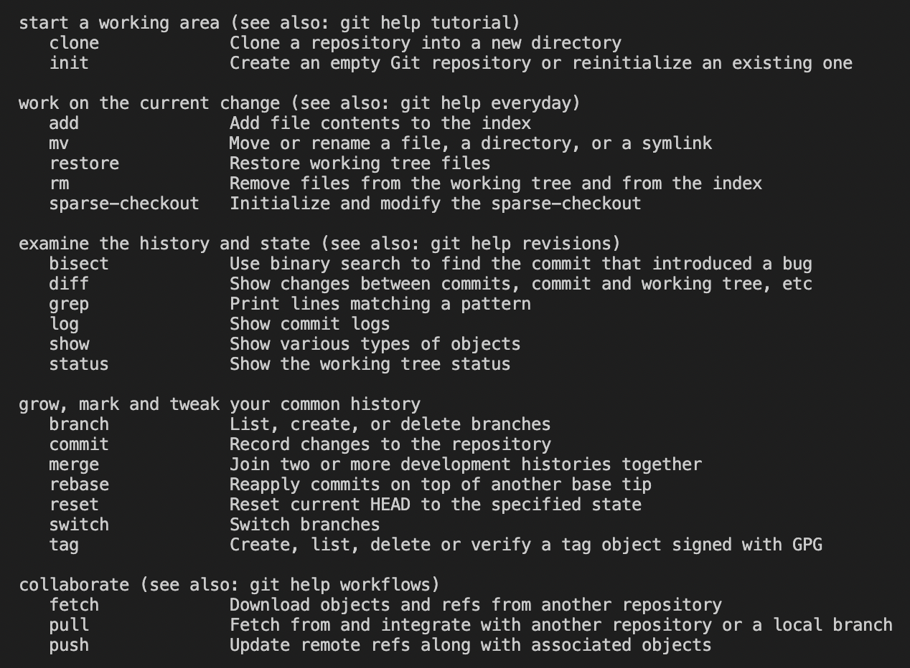

# 🅖 Git

## 1.  개요

- 깃은 2005년 리누스 토르발스가 개발한 분산 버전 관리 시스템이다.

## 2. 특징

 - 깃은 컴퓨터 파일의 변경 사항을 추적한다.
 - 깃은 사용자들 간의 작업을 조율한다.

- 깃은 세 공간으로 구성된다.

  - Working Directory

  - Staging Area

  - Repository


## 3. 명령어



> git --help를 입력했을 때 나오는 화면. 모든 명령어를 확인하려면 git help -a를 입력할 것.


### 3.1. 기본 설정을 위한 명령어

> git 저장소를 최초 설정할 때 이름과 이메일을 등록해야 한다.

- 이름 설정

```zsh
git config --global user.name “username”
```


- 이름 설정 확인

```zsh
git config user.name
```


- 이메일 설정

```zsh
git config --global user.email “my@email.com”
```


- 이메일 설정 확인

```zsh
git config --global -l
```


- 전체 확인

```zsh
git config -l
```


### 3.2. Start a working area

- 원격저장소를 복제해, 새로운 저장소를 만든다.

```zsh
git clone
```


- 새로운 저장소를 만든다.

```zsh
git init
```


### 3.3. Work on the current change

- Working Directory에서 Staging Area로 옮긴다.
  - git add .: 모든 파일 추가.

```zsh
git add <파일명>
```


### 3.4. Examine the history and state 

- 현재 상태를 알려준다. (Working Directory, Staging Area)

```zsh
git status
```


- 현재 버전을 알려준다. (Repository)

  - git log -1: 가장 최근 버전을 보여달라.

  - git log --oneline: 한 줄로 표시해달라.

  - git log -2 --oneline: 가장 최근 버전 두 개까지 한 줄로 보여달라.

```zsh
git log
```


### 3.5. Grow, mark and tweak you common history

- Working Directory에서 Repository로 옮기고 커밋메시지를 추가한다.
  - git commit: 좀 더 긴 메시지를 담을 수 있는 작업을 실행한다.

```zsh
git commit -m '<커밋메시지>'
```


### 3.6. Collaborate

- 원격저장소에서 로컬저장소로 커밋을 옮긴다.

```zsh
git pull origin master
```


- 로컬저장소에서 원격저장소로 커밋을 옮긴다.

```zsh
git push origin master
```


## 4. 관련 자료

[Pro_Git](https://git-scm.com/book/ko/v2)

