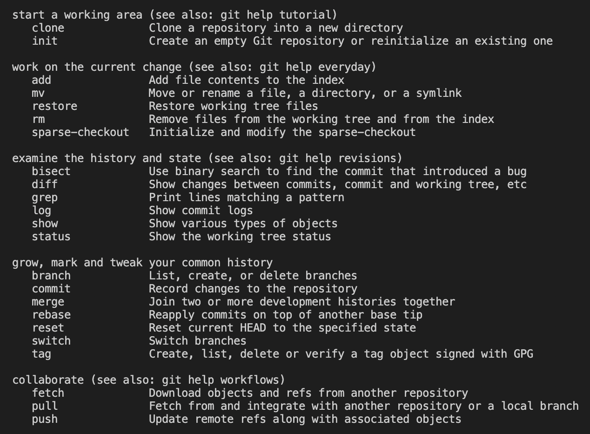

# Git/GitHub

<details>
<summary>Git</summary>
<div markdown="1">

# 🅖 Git

## 1.  개요

- 깃은 2005년 리누스 토르발스가 개발한 분산 버전 관리 시스템이다.

## 2. 특징

 - 깃은 컴퓨터 파일의 변경 사항을 추적한다.
 - 깃은 사용자들 간의 작업을 조율한다.

- 깃은 세 공간으로 구성된다.

  - Working Directory

  - Staging Area

  - Repository


## 3. 명령어



> git --help를 입력했을 때 나오는 화면. 모든 명령어를 확인하려면 git help -a를 입력할 것.


### 3.1. 기본 설정을 위한 명령어

> git 저장소를 최초 설정할 때 이름과 이메일을 등록해야 한다.

- 이름 설정

```zsh
git config --global user.name “username”
```


- 이름 설정 확인

```zsh
git config user.name
```


- 이메일 설정

```zsh
git config --global user.email “my@email.com”
```


- 이메일 설정 확인

```zsh
git config --global -l
```


- 전체 확인

```zsh
git config -l
```


### 3.2. Start a working area

- 원격저장소를 복제해, 새로운 저장소를 만든다.

```zsh
git clone
```


- 새로운 저장소를 만든다.

```zsh
git init
```


### 3.3. Work on the current change

- Working Directory에서 Staging Area로 옮긴다.
  - git add .: 모든 파일 추가.

```zsh
git add <파일명>
```


### 3.4. Examine the history and state 

- 현재 상태를 알려준다. (Working Directory, Staging Area)

```zsh
git status
```


- 현재 버전을 알려준다. (Repository)

  - git log -1: 가장 최근 버전을 보여달라.

  - git log --oneline: 한 줄로 표시해달라.

  - git log -2 --oneline: 가장 최근 버전 두 개까지 한 줄로 보여달라.

```zsh
git log
```


### 3.5. Grow, mark and tweak you common history

- Working Directory에서 Repository로 옮기고 커밋메시지를 추가한다.
  - git commit: 좀 더 긴 메시지를 담을 수 있는 작업을 실행한다.

```zsh
git commit -m '<커밋메시지>'
```


### 3.6. Collaborate

- 원격저장소에서 로컬저장소로 커밋을 옮긴다.

```zsh
git pull origin master
```


- 로컬저장소에서 원격저장소로 커밋을 옮긴다.

```zsh
git push origin master
```


## 4. 관련 자료

[Pro_Git](https://git-scm.com/book/ko/v2)

</div>
</details>

<details>
<summary>Git_Branch</summary>
<div markdown="1">

# Git_Branch

## 1. 개요

깃브랜치는 한 저장소 안에서 다른 영역을 다룰 때 사용하는 개념이다.

## 2. 명령어

### 1. 브랜치 생성

   ```bash
   (master) $ git branch {브랜치명}
   ```

### 2. 브랜치 이동

   ```bash
   (master) $ git checkout {브랜치명}
   ```

### 3. 브랜치 생성 및 이동

   ```bash
   (master) $ git checkout -b {브랜치명}
   ```

### 4. 브랜치 삭제

   ```bash
   (master) $ git branch -d {브랜치명}
   ```

### 5. 브랜치 목록

   ```bash
   (master) $ git branch
   ```

### 6. 브랜치 병합

   ```bash
   (master) $ git merge {브랜치명}
   ```

   * master 브랜치에서 {브랜치명}을 병합

## 3. 브랜치를 병합하는 경우

### 상황 1. fast-foward

> fast-foward는 feature 브랜치 생성된 이후 master 브랜치에 변경 사항이 없는 상황

1. feature/home branch 생성 및 이동

   ```bash
   (master) $ git branch feature/home
   (master) $ git checkout feature/home
   ```

2. 작업 완료 후 commit

   ```bash
   (feature/home) $ touch home.txt
   (feature/home) $ git add .
   (feature/home) $ git commit -m 'Add home.txt'
   (feature/home) $ git log --oneline
   b534a34 (HEAD -> feature/home) Complete Home!!!!
   e89616a (master) Init
   ```


3. master 이동

   ```bash
   (feature/home) $ git checkout master
   (master) $ git log --oneline
   ```

4. master에 병합

   ```bash
   (master) $ git merge feature/home 
   Updating e89616a..b534a34
   Fast-forward
    home.txt | 0
    1 file changed, 0 insertions(+), 0 deletions(-)
    create mode 100644 home.txt
   ```

5. 결과 : fast-foward

   ```bash
   (master) $ git log --oneline
   b534a34 (HEAD -> master, feature/home) Complete Home!!!!
   e89616a Init
   ```

6. branch 삭제

   ```bash
   (master) $ git branch -d feature/home 
   Deleted branch feature/home (was b534a34).
   ```

***

### 상황 2. merge commit

   > 서로 다른 이력(commit)을 병합(merge)하는 과정에서 **다른 파일이 수정**되어 있는 상황
   >
   > git이 auto merging을 진행하고, **commit이 발생된다.**

   1. feature/about branch 생성 및 이동

      ```bash
      (master) $ git checkout -b feature/about
      (feature/about) $
      ```

   2. 작업 완료 후 commit

      ```bash
      (feature/about) $ touch about.txt
      (feature/about) $ git add .
      (feature/about) $ git commit -m 'Add about.txt'
      (feature/about) $ git log --oneline
      5e1f6de (HEAD -> feature/about) 자기소개 페이지 완료!
      b534a34 (master) Complete Home!!!!
      e89616a Init
      ```

   3. master 이동

      ```bash
      (feature/about) $ git checkout master
      (master) $
      ```

   4. *master에 추가 commit 발생시키기!!*

      * **다른 파일을 수정 혹은 생성할 것!**

      ```bash
      (master) $ touch master.txt
      (master) $ git add .
      (master) $ git commit -m 'Add master.txt'
      (master) $ git log --oneline
      98c5528 (HEAD -> master) 마스터 작업....
      b534a34 Complete Home!!!!
      e89616a Init
      ```

   5. master에 병합

      ```bash
      (master) $ git merge feature/about
      ```

   6. 결과 -> 자동으로 *merge commit 발생*

   7. 커밋 및 그래프 확인하기

      ```bash
      $ git log --oneline --graph
      *   582902d (HEAD -> master) Merge branch 'feature/about'
      |\
      | * 5e1f6de (feature/about) 자기소개 페이지 완료!
      * | 98c5528 마스터 작업....
      |/
      * b534a34 Complete Home!!!!
      * e89616a Init
      ```

   8. branch 삭제

      ```bash
      $ git branch -d feature/about 
      Deleted branch feature/about (was 5e1f6de).
      ```


---

### 상황 3. merge commit 충돌

   > 서로 다른 이력(commit)을 병합(merge)하는 과정에서 **같은 파일의 동일한 부분이 수정**되어 있는 상황
   >
   > git이 auto merging을 하지 못하고, 충돌 메시지가 뜬다.
   >
   > 해당 파일의 위치에 표준형식에 따라 표시 해준다.
   >
   > 원하는 형태의 코드로 직접 수정을 하고 직접 commit을 발생 시켜야 한다.

   1. feature/test branch 생성 및 이동

      ```bash
      (master) $ git checkout -b feature/test
      ```

   2. 작업 완료 후 commit

      ```bash
      # README.md 파일 열어서 수정
      (feature/test) $ touch test.txt
      (feature/test) $ git add .
      (feature/test) $ git commit -m 'Add test.txt'
      (feature/test) $ git log --oneline
      95fad1c (HEAD -> feature/test) README 수정하고 test 작성하고
      582902d (master) Merge branch 'feature/about'
      98c5528 마스터 작업....
      5e1f6de 자기소개 페이지 완료!
      b534a34 Complete Home!!!!
      e89616a Init
      ```


   3. master 이동

      ```bash
      $ git checkout master
      ```


   4. *master에 추가 commit 발생시키기!!*

      * **동일 파일을 수정 혹은 생성할 것!**

      ```bash
      # README.md 파일 열어서 수정
      (master) $ git add README.md
      (master) $ git commit -m 'Update README.md'
      ```

   5. master에 병합

      ```bash
      (master) $ git merge feature/test 
      Auto-merging README.md
      CONFLICT (content): Merge conflict in README.md
      Automatic merge failed; fix conflicts and then commit the result.
      ```


   6. 결과 -> *merge conflict발생*

      > git status 명령어로 충돌 파일을 확인할 수 있음.

      ```bash
      (master|MERGING) $ git status
      On branch master
      You have unmerged paths.
        (fix conflicts and run "git commit")        
        (use "git merge --abort" to abort the merge)
      
      Changes to be committed:
              new file:   test-1.txt
              new file:   test-2.txt
              new file:   test.txt
      
      Unmerged paths:
        (use "git add <file>..." to mark resolution)
              both modified:   README.md
      ```


   7. 충돌 확인 및 해결

      ```
      <<<<<<< HEAD
      # 마스터에서 작업함...
      =======
      # 테스트에서 작성
      >>>>>>> feature/test
      ```

      => 나보고 고치라는 것인가 학생^^?


   8. merge commit 진행

      ```bash
      (master|MERGING) $ git add .
      (master|MERGING) $ git commit
      ```

      * vim 편집기 화면이 나타난다.

        * 자동으로 작성된 커밋 메시지를 확인하고, `esc`를 누른 후 `:wq`를 입력하여 저장 및 종료를 한다.
        * `w` : write
        * `q` : quit

      * vs code 편집기에서 메시지보고 닫기.

   9. 커밋 및 확인하기

      ```bash
      (master) $ git log --oneline --graph
      *   bc1c0cd (HEAD -> master) Merge branch 'feature/test'
      |\  
      | * 95fad1c (feature/test) README 수정하고 test 작성하고
      * | 2ecad28 리드미 수정
      |/  
      *   582902d Merge branch 'feature/about'
      |\  
      | * 5e1f6de 자기소개 페이지 완료!
      * | 98c5528 마스터 작업....
      |/  
      * b534a34 Complete Home!!!!
      * e89616a Init
      ```


   10. branch 삭제

       ```bash
       (master) $ git branch -d feature/test
       ```


</div>
</details>

<details>
<summary>GitHub</summary>
<div markdown="1">

# 🅖🅗 GitHub

## 1. 개요

- 깃헙은 네트워크를 활용한 원격저장소이다.

## 2. 특징

- 깃헙은 'https://github.com/유저이름/저장소이름'라는 주소로 구성된다.

## 3. 명령어

### 3.1. 기본 설정을 위한 명령어

- 원격저장소(github) 정보를 로컬 저장소에 추가
- (깃아~ 원격저장소에 추가해줘~ 오리진이라는 이름으로 주소를~! )

```zsh
git remote add origin <원격저장소 주소>
```


- 확인

```zsh
git remote -v
```


- 삭제

```zsh
git remote rm <원격저장소이름>
```


### 3.2. 버전 복제 & 이동을 위한 명령어

- 원격저장소로 로컬저장소 변경사항을 옮긴다.
- e.g.: git push origin master
  - push 실패 시 - 로컬과 원격 저장소 간 커밋 충돌이 일어난 것이다. 
  - 해결법: 원격저장소 pull 먼저 하고 로컬에서 통합한 후 push할 것.

```zsh
git push <원격저장소이름> <브랜치이름>
```


- 로컬저장소로 원격저장소 변경사항을 옮긴다.
- e.g.: git pull origin master

```zsh
git pull <원격저장소이름> <브랜치이름>
```


- 원격저장소를 복제하여 로컬저장소로 가져온다.

```zsh
git clone <원격저장소 주소>
```


### 3.3. 예외 처리를 위한 명령어

- touch .gitignore로 .gitignore 파일을 생성.
- .gitignore 안에 예외 처리할 파일, 폴더, 확장자(<*.확장자>로 표시)를 추가한다.
  - 이미 커밋된 작업은 예외 처리 불가.
  - [Gitignore.io](https://www.toptal.com/developers/gitignore/): 예외 처리 파일을 만들어주는 사이트.

```zsh
touch .gitignore
```

</div>
</details>


<details>
<summary>Pull_Request</summary>
<div markdown="1">

# Pull_Request

## 1. 개요

- 풀리퀘스트는 서로 다른 브랜치를 로컬저장소 내에서 병합(merge)하지 않고, GitHub을 통해 병합하는 과정이다. 

## 2. 특징

- 원격저장소의 권한 유무에 따라 병합 과정이 달라진다.

## 3. 과정

### 1. 원격저장소의 권한이 있을 경우

1. 자신 혹은 타인이 git push origin <브랜치이름> 명령어로 명령을 내린다.
2. GitHub에서 Pull_Request 과정을 실행한다.
3. Merge 버튼을 누른다.

### 2. 원격저장소의 권한이 없을 경우

1. Fork[^1]할 저장소에서 우측 상단의 Fork버튼을 누른다.
2. 자신의 원격저장소에 저장될 이름을 작성하고 Create fork 한다.
3. 자신의 원격저장소에서 확인한다.
4. Fork 받아온 저장소를 로컬로 clone 한다.
5. branch를 생성하고 이동한다.
6. 작업 완료 후 변경 사항을 add, commit, push 한다.
7. Github에서 Compare & pull request를 생성한다.
   - 이 과정은 6번 이후 생성된 VSCode 내 링크로 대체 가능하다.
8. pull request 내용을 작성한 후 create pull request 한다.


[^1]:권한 없는 저장소를 복제하는 기능이다.

</div>
</details>